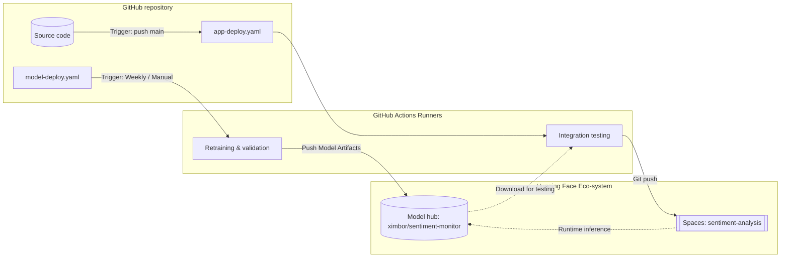

# 📈 Sentiment Analysis Monitor  

The project's goal is to enhance and monitor social media reputation through automated sentiment analysis by implementing a continuous monitoring system and sentiment analysis model retraining.

**Solution Benefits**

1.  **Sentiment Analysis Automation**: By implementing a sentiment analysis model based on FastText, it will be possible to automate the processing of social media data to identify positive, neutral, and negative sentiments.
This will enable a rapid and targeted response to user feedback.
    
2.  **Continuous Reputation Monitoring**: Using MLOps methodologies, implement a continuous monitoring system to evaluate user sentiment trends over time.
This will allow for the quick detection of changes in company perception and prompt intervention if necessary.
    
3.  **Model Retraining**: Introducing an automated retraining system for the sentiment analysis model will ensure that the algorithm adapts dynamically to new data and shifts in language and user behavior on social media.
Maintaining high predictive accuracy is essential for a correct sentiment assessment.


## 🛠️ Endpoints

### 1. Readiness Check
Ensures that the service is up and, more importantly, that the machine learning model has been successfully loaded into memory.

-   **URL:** `/ready`    
-   **Method:** `GET`
-   **Success Response:**
    -   **Code:** 200 OK
    -   **Content:** `{"status": "ready"}`
        -   **Error Response:**
    -   **Code:** 503 Service Unavailable        
    -   **Content:** `{"detail": "Model loading..."}`        
    -   **Reason:** The model is still being initialized or failed to load.
        

### 2. Predict Sentiment
Analyzes the input text and returns the predicted sentiment label (Positive/Neutral/Negative) and a confidence score.

-   **URL:** `/predict`    
-   **Method:** `POST`    
-   **Request Body:**         
    ```
    {
      "text": "The new product launch was a great success!"
    }    
    ```
    
-   **Success Response:**
        -   **Code:** 200 OK
            -   **Content Example:**      
      ```
        {
          "text": "The new product launch was a great success!",
          "sentiment": "POSITIVE",
          "confidence": 0.9985
        }
       ```
        
-   **Error Response:**
    
    -   **Code:** 503 Service Unavailable
        
    -   **Content:** `{"detail": "Model not ready"}`  
  

## 🚀 CI/CD workflows  
This section describes the automated GitHub Actions workflows used to maintain and deploy the sentiment analysis system. These workflows ensure the model is regularly updated and the application is reliably deployed.

----------

### 1. Model Retraining and Deployment (`model-deploy.yaml`)

This workflow automates the machine learning lifecycle, including scheduled retraining, validation, and model publishing.

-   **Triggers**:
    
    -   **Scheduled**: Runs automatically every Monday at 03:00 UTC.
        
    -   **Manual**: Can be triggered manually via `workflow_dispatch`.
        
-   **Job: Train and Validate**:
    
    -   **Environment**: Uses `ubuntu-latest` with Python 3.9.
        
    -   **Execution**: Installs necessary ML libraries (`transformers`, `torch`, `scikit-learn`) and runs the `scripts/retrain.py` script.
        
    -   **Testing**: Validates the newly trained model using `pytest` against the application logic.
        
    -   **Artifacts**: Saves the trained model files as a temporary workflow artifact.
        
-   **Job: Deploy**:
    
    -   **Condition**: Only executes on the `main` branch after successful training.
        
    -   **Action**: Downloads the model artifacts and pushes them to the **Hugging Face Model Hub** repository `ximbor/sentiment-monitor`.
        

----------

### 2. Application Deployment (`app-deploy.yaml`)

This workflow handles the Continuous Integration (CI) and Continuous Deployment (CD) of the FastAPI web service to Hugging Face Spaces.

-   **Triggers**:
    
    -   **Code Push**: Triggered whenever changes are made to `main.py`, `Dockerfile`, or `requirements.txt` on the `main` branch.
        
    -   **Manual**: Can be triggered manually via `workflow_dispatch`.
        
-   **Job: Test**:
    
    -   **Preparation**: Downloads the latest production model from the Hugging Face Hub.
        
    -   **Validation**: Runs integration tests using `httpx` and `pytest` to ensure the API correctly handles sentiment requests with the current model.
        
-   **Job: Deploy**:
    
    -   **Action**: Uses Git LFS to push the application source code to **Hugging Face Spaces** (`ximbor/sentiment-analysis`).
        
    -   **Infrastructure**: The deployment utilizes the remote Hugging Face repository to host the containerized FastAPI application.

